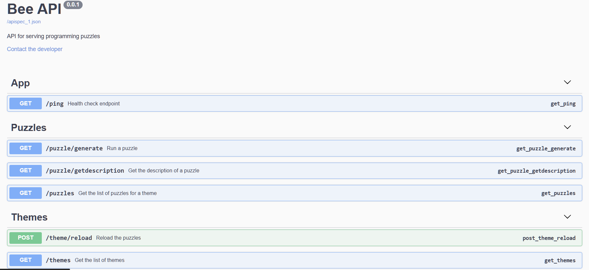

# BeeAPI - Self-Hostable API

BeepAPI is a self-hostable API that will be able to load puzzles from `.alghive` files, under themes and serve them to the AlgoHive platform independently.



## AlgoHive

AlgoHive is a web, self-hostable plateform that allows developers to create puzzles for developers to solve. Each puzzle contains two parts to solve, allowing developers to test their skills in a variety of ways. The puzzles are created using a proprietary file format that is compiled into a single file for distribution.

## Installation

To use BeeAPI, you need to have Python 3.6 or higher installed on your system.

Then, you can install the dependencies using the following command:

```bash
pip install -r requirements.txt
```

Feed the `puzzles` directory with themes folders containing `.alghive` files.

```
beeapi/
├── puzzles/
│   ├── theme1/
│   │   ├── puzzle1.alghive
│   │   ├── puzzle2.alghive
│   ├── theme2/
│   │   ├── puzzle3.alghive
│   │   ├── puzzle4.alghive
```

Run the API using the following command:

```bash
python3 server.py
```

## Routes
